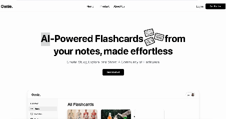
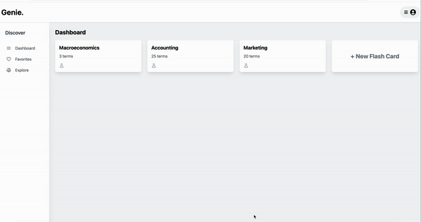
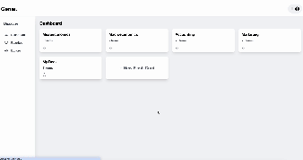
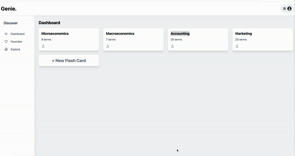

<p align="center">
    
</p>

# Genie: The Best AI-Powered Flashcard Generator
[Live Site!](https://genie-7kp5.onrender.com/)
## Background and overview
**Genie** is a study aid app that leverages AI to generate flashcards from user-uploaded notes. Users can create flashcard decks using AI, customize them to their liking, and search through existing decks created by other users.

## Functionality and MVP
- User Authentication: Secure sign-up and login
- User generated flashcards: Create, read, update, and delete flashcards
- AI generated flashcards (CRUD): Generate flashcards from user-uploaded notes using OpenAI API
- Explore page/Community Sharing: Users can browse and access decks created by others
- Search: Implement search capabilities to find flashcards and decks created by other users
- Favorites: Allow users to save their favorite flashcards for easy access
- Production README

## UI/UX
The goal is to make a sleek and intuitive interface for users to quickly engage with. Pages will be self-explanatory with a minimal feel to avoid overwhelming users.

## WireFrames


### Architecture
Genie is built with the MERN stack (MongoDB, Express, React, and Node)


## Technologies and Technical Challenges

### Database: MongoDB and Mongoose
MongoDB, a NoSQL database, will be used for its flexibility and scalability. Mongoose will be employed to define schemas and models, enabling efficient data validation and manipulation.

### Backend: Node.js, Express.js, and OpenAI
The backend's primary role is to handle user authentication, store flashcard data, and integrate with the OpenAI API to generate flashcards.

### Frontend: React, Redux, and TailwindCSS
React and Redux will handle the application state, ensuring a responsive and dynamic user experience. TailwindCSS will be utilized for styling, allowing for rapid and consistent UI development.

## Features

### User authentication
Securely log in to Genie to access your personalized dashboard. Ensure your data is protected with robust authentication methods.



### User generated flash cards
Create custom flashcards manually to suit your study needs. Easily add questions and answers, and organize your cards into decks.



### Genie generated flash cards using openAI
Upload a PDF and let Genie automatically generate flashcards for you. Powered by the OpenAI API, Genie extracts key concepts and questions to help you study efficiently.



To generate flashcards automatically, Genie parses the uploaded PDF file and extracts text. This text is then processed by OpenAI's API to create flashcards. Below is a code snippet showing the core functionality

```javascript
const storage = multer.memoryStorage(); // Store file in memory for quick processing
const upload = multer({ 
    storage: storage,
    limits: { fileSize: MAX_SIZE }
});

router.post('/', requireUser, upload.single('pdfFile'), async (req, res, next) => {
    try {
        if (!req.file) {
            return res.status(400).json({ message: 'No files were uploaded.' });
        }

        const pdfBuffer = req.file.buffer;
        const pdfText = await pdfParse(pdfBuffer);
        const parsedText = pdfText.text.replace(/\n/g, ' ');

        // Here you can add code to send the parsedText to OpenAI API to generate flashcards

        return res.json({ text: parsedText });
    } catch (err) {
        next(err);
    }
});
```

### Review Decks
Organize and review your flashcards in decks. 




## Future Implementatioms
- Quiz
- Trending/Rating

## Group Members and Work Breakdown
**Charlie, Rafa, Jaspreet, Dharani, Edison**

### Day 1 (June 10th)
- Build skeleton react site, landing page, login/signup modal - **Jaspreet, Dharani, Edison**
- Backend skeleton, User auth, Flashcard model/migration - **Charlie, Rafa**
- Openai api testing - **Edison**

### Day 2 (June 11th)
- Navbar, dashboard for flashcard decks (index page), CRUD components for flashcards - **Jaspreet, Dharani**
- CRUD Flashcard controller/routes, include boolean value for show (allow other users to see), seed file - **Charlie, Rafa, Edison**

### Day 3 (June 12th)
- Search bar, action/reducers for making flashcard api request, studying flashcard page - **Jaspreet, Dharani, Edison**
- search functionaility, import pdf from frontend, pass it into openai api and return json object - **Charlie, Rafa**

### Day 4 (June 13th)
- Upload pdf section for ai generated flashcards, explore page for all users flashcard decks (initial seed data) - **Jaspreet, Dharani**
- Add favorites to database schema, add algo for a smart studying feature (bonus) - **Charlie, Rafa**

### Day 5 (June 14th)
- Polish, host, debug, dont crash the site - **Everyone**
- TBD

## Group Members

- [Edison Li](https://www.linkedin.com/in/edison-l-832242167/)
- [Charles Racine](https://www.linkedin.com/in/charlee-racine-50241a7b/)
- [Jaspreet Singh]()
- [Rafael Campos](https://www.linkedin.com/in/rafael-campos-60471a2b2/)
- [Dharani Yedavelly](https://www.linkedin.com/in/dharaniy/)
